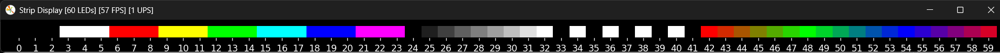

# ledstripdynamics

A library for amazing light shows on LED-Strips

## Description

The LedStripDynamics (LSD) library is currently in its early development stages. It aims to develop a library for creating light effects and animations on LED strips. The library will support customizable and combinable effects, enabling the creation of highly dynamic light shows. The initial phase of development focuses on simulating LED strip behavior, with subsequent support planned for WS2812B LED strips and other types of LED strips. The ultimate goal is to establish a foundational visual library that can be utilized in future projects, such as an AI-driven music visualizer.

## Features

- LED Strip emulation on the PC monitor
- Images with background Images
- Strip to apply Images to a LED strip driver

## Installation

1. Create and activate a virtual environment
2. Install the lsd package in editable mode with ``python.exe -m pip install -e .``
3. Optionally, to build the documentation
   1. Install *doc* dependencies ``python.exe -m pip install -e .[doc]``
   2. Install [Graphviz](https://graphviz.org/).

## Examples
Once installed the project can be used like any other library. A minimal example snippet sits right below. A few demonstrational scripts are provided in the ``demos`` folder.

```python
from multiprocessing import freeze_support
from lsd.strip import Strip, test_img

if __name__ == '__main__':
   freeze_support()  # Required!

   s = Strip(60, show_index=True)
   s[:] = test_img(s.n)

   s.show()
   input()
```



## Documentation

The project documentation can be generated through [Sphinx](https://www.sphinx-doc.org/en/master/). Necessary files are located in the ``doc`` folder. To build the documentation run the ``lsd-docs -b`` command in a CLI. The build documentation can be viewed in a browser by running ``lsd-docs -o``.

> **NOTE:** To build the documentation the optional dependencies and [Graphviz](https://graphviz.org/) must be installed.

## Acknowledgments

- Visual effects inspired by [Dave Plummer](https://www.youtube.com/@DavesGarage)'s LED strip tutorials.

## License

GNU General Public License (GPL)
